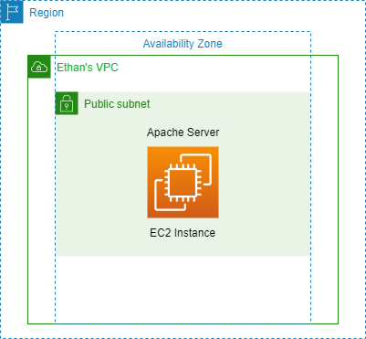
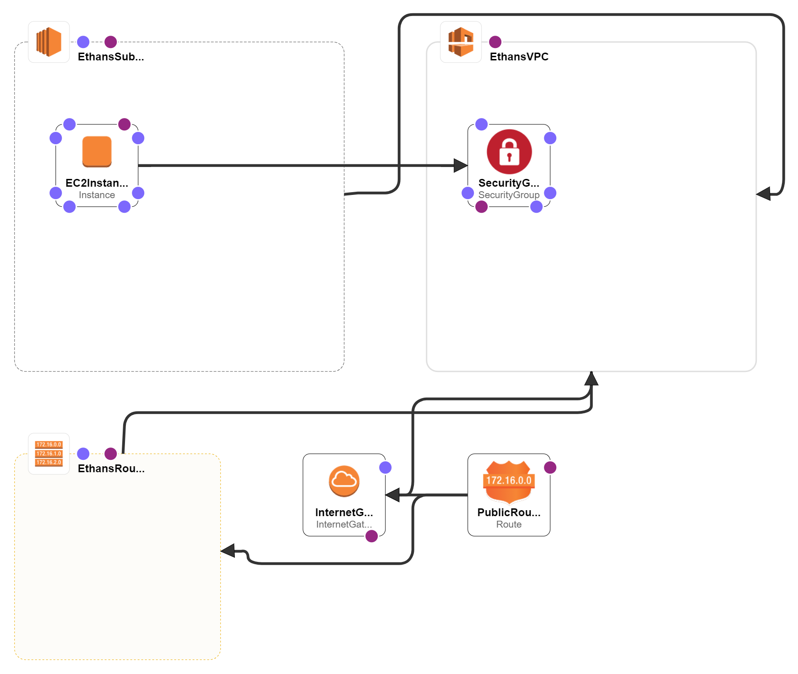
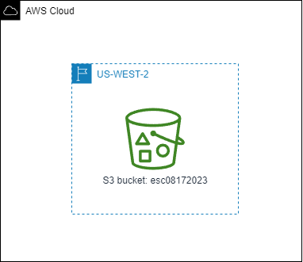
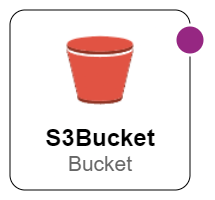
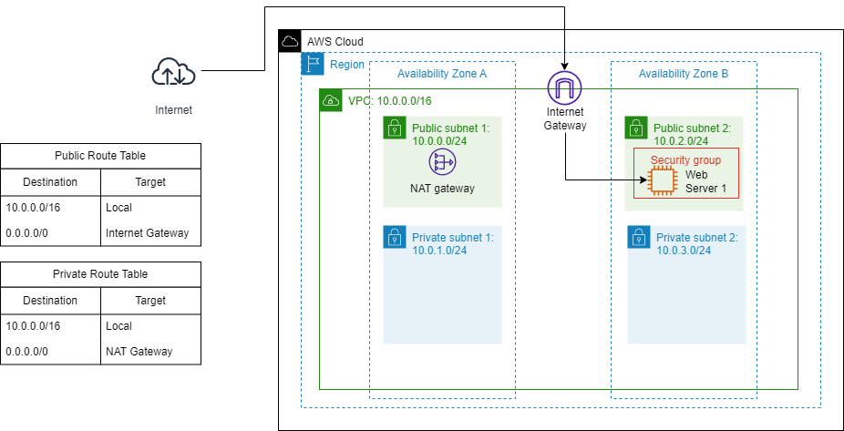
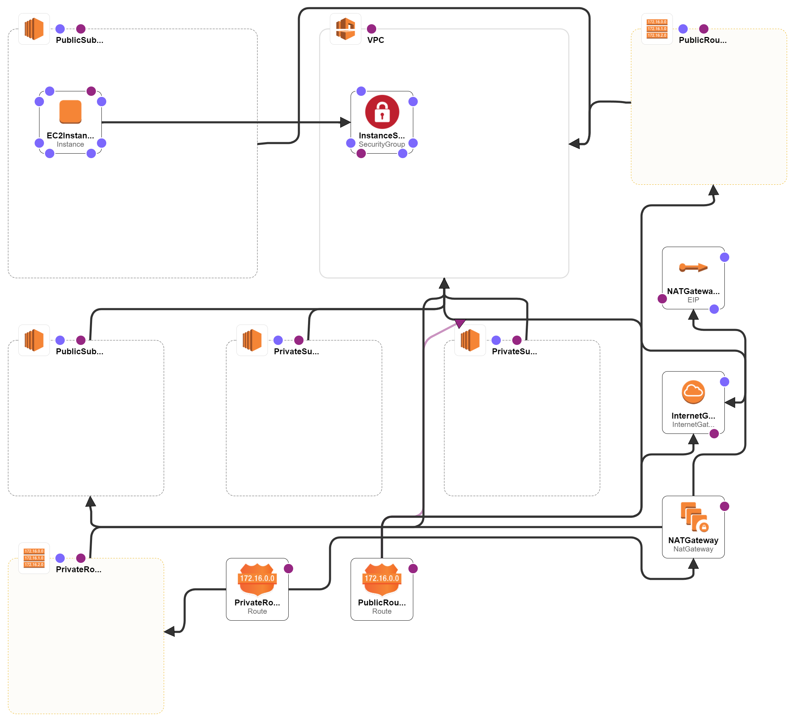
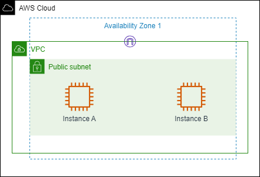
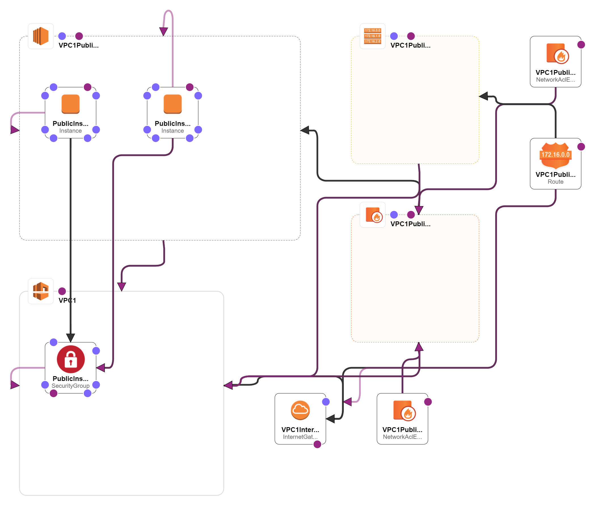

<h1 align="center">Welcome to Ethan's AWS CloudFormation Series!!!</h1>

<h3 align="center">In this sub-directory contains hopefully many cloudformation templates for creating whatever resources you may need to create for yourself.</h3>

<h2 align="center"> AWS-CloudFormation</h2>

<h3 align="center">Project EC2 stack using CloudFormation Template</h3>

|   draw.io                 |   Designer in CloudFormation      |
|---------------------------|-----------------------------------|
| |  |

<h3 align="center">Project S3 stack using CloudFormation Template</h3>

Note
 
This only creates an empty bucket need to use management console to upload file to this bucket.

|   draw.io                 |   Designer in CloudFormation      |
|---------------------------|-----------------------------------|
| |  |

<h3 align="center">Project VPCWebServer stack using CloudFormation Template</h3>

|   draw.io                 |   Designer in CloudFormation      |
|---------------------------|-----------------------------------|
| |  |

<h3 align="center">Project InternetProtocol stack using CloudFormation Template</h3>

|   draw.io                 |   Designer in CloudFormation      |
|---------------------------|-----------------------------------|
| |  |